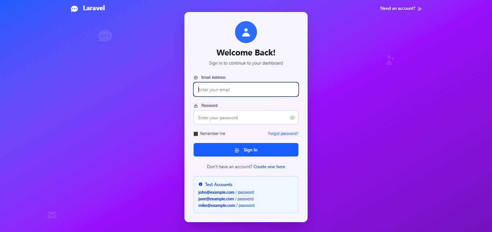
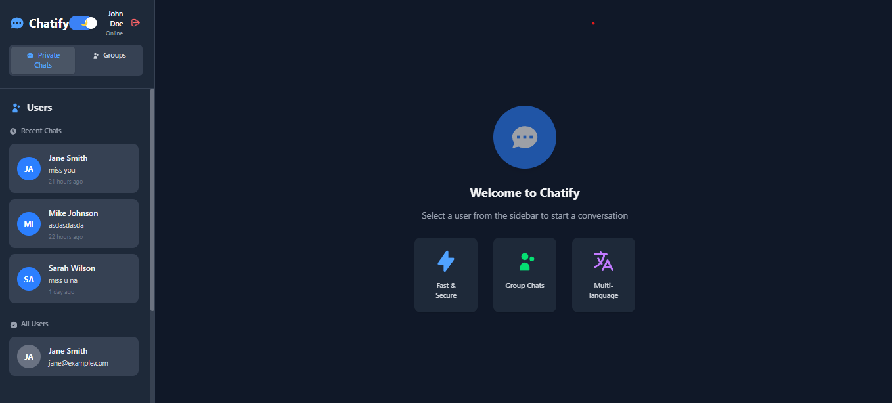

# Laravel Chatify

A **real-time chat messaging system** built with **Laravel + Chatify** for learning socket-based chat applications with a clean workflow.

---

## 🚀 Features

✅ Real-time messaging using Laravel Echo and Pusher  
✅ User-to-user private chat  
✅ Read/seen indicators  
✅ User authentication  
✅ Responsive and clean chat UI  
✅ Laravel best practices

---

## 🛠️ Installation

1️⃣ **Clone the repository:**

```bash
git clone https://github.com/4urie/laravel-chatify.git
cd laravel-chatify
```
2️⃣ Install dependencies:
```bash
composer install
npm install
```
3️⃣ Setup environment:
```bash
cp .env.example .env
php artisan key:generate
```
4️⃣ Configure .env:

Set your database credentials.

Set your Pusher credentials for real-time messaging:
```bash
PUSHER_APP_ID=your_id
PUSHER_APP_KEY=your_key
PUSHER_APP_SECRET=your_secret
PUSHER_APP_CLUSTER=your_cluster
```
5️⃣ Run migrations:
```bash
php artisan migrate
```

6️⃣ Compile assets:
```bash
npm run build
```
(or npm run dev during development)

7️⃣ Run the server:
```bash
php artisan serve
```

📸 Screenshots
Chat UI




🧰 Tech Stack
Laravel 12

Chatify

Laravel Echo + Pusher

PHP 8.x

MySQL

TailwindCSS / Bootstrap
